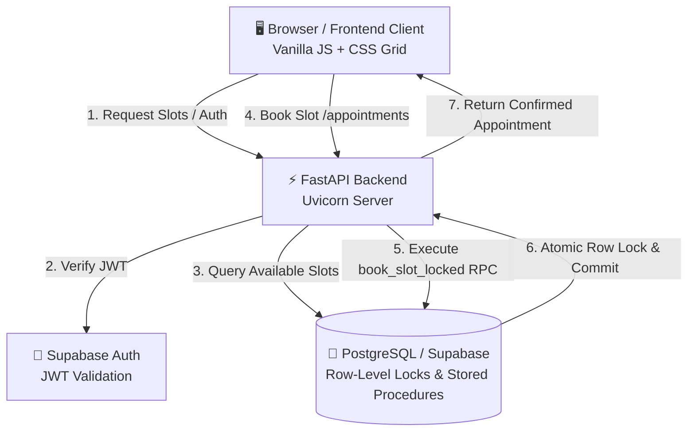

# 📅 Appointment Booking System

[](https://www.python.org/)
[](https://fastapi.tiangolo.com/)
[](https://supabase.com/)
[](https://docs.pytest.org/)
[](LICENSE)

A production-ready, concurrency-safe appointment booking application featuring a **modern calendar date picker**, real-time slot filtering, atomic row-level locking to prevent double bookings, and a lightweight vanilla frontend with zero npm dependencies.

---

## ✨ Features

- **🗓️ Modern Calendar GUI Date Picker**
  - Interactive monthly calendar with smooth chevron navigation.
  - Highlights **Today** with an accent ring and **Selected Date** with an elevated pill.
  - Visual dot indicators (`•`) marking dates with open appointment availability.
  - Automatic filtering to show only slots for the selected date.
  - Responsive layout optimized for desktop and mobile screens.

- **🔒 Concurrency-Safe & ACID Compliant**
  - Row-level database locks (`SELECT FOR UPDATE`) via PostgreSQL stored procedures (`book_slot_locked`).
  - Zero double-booking vulnerability — tested under high-concurrency race conditions.
  - Handles 409 Conflict gracefully with friendly UI feedback and auto-refresh.

- **⏱️ Flexible Booking & Slot Management**
  - Dynamic start/end times with timezone-aware ISO 8601 formatting.
  - Supports both single-capacity and multi-capacity booking models.
  - Temporary hold mechanism (`/slots/{id}/hold`) with expiration timers.
  - Instant cancellation with automatic availability restoration.

- **🔐 Authentication & User Roles**
  - Secure authentication powered by Supabase Auth (JWT tokens).
  - Role-based access control (`customer`, `staff`, `admin`).
  - Account export and GDPR deletion endpoints.

- **⚡ Lightweight Zero-Build Frontend**
  - Pure HTML5, modern CSS3 (custom properties, CSS Grid), and modular vanilla JavaScript.
  - No bundlers, Webpack, or npm dependencies required.

---

## 🏗️ Architecture Overview



---

## 📂 Project Structure

```text
appointment-booking/
├── backend/
│   ├── app/
│   │   ├── middleware/        # Rate limiting & security middlewares
│   │   ├── routers/           # API routes (auth, booking, health, ops)
│   │   ├── schemas/           # Pydantic request & response models
│   │   ├── security/          # Webhook signatures & token verification
│   │   ├── services/          # Business logic (availability, booking, recurrence)
│   │   ├── config.py          # Environment settings & validation
│   │   ├── dependencies.py    # FastAPI dependencies (auth principals, roles)
│   │   ├── errors.py          # Database exception mapping to HTTP errors
│   │   ├── main.py            # FastAPI app initialization & CORS
│   │   └── supabase_client.py # Supabase client singleton
│   ├── sql/                   # Database migrations & stored procedures
│   └── tests/                 # Integration, concurrency, and unit tests
├── frontend/
│   ├── app.js                 # Frontend application & calendar state logic
│   ├── index.html             # Application layout & markup
│   ├── styles.css             # Modern design system & calendar styles
│   └── README.md              # Frontend quickstart
├── Dockerfile                 # Containerization configuration
├── requirements.txt           # Python dependencies
└── README.md                  # Project documentation
```

---

## 🚀 Getting Started

### Prerequisites

- **Python 3.11+** (tested on Python 3.13)
- A **Supabase** project (or local PostgreSQL with Supabase CLI)

### 1. Clone the Repository

```bash
git clone https://github.com/divaznx/appointment-booking.git
cd appointment-booking
```

### 2. Configure Environment Variables

Create a `.env` file in the `backend/` directory:

```bash
cp backend/.env.example backend/.env
```

Edit `backend/.env` with your Supabase credentials:

```ini
SUPABASE_URL=https://your-project.supabase.co
SUPABASE_KEY=your-service-role-or-anon-key
ENVIRONMENT=development
AUTO_CONFIRM_EMAIL=true
CORS_ORIGINS=http://localhost:3000,http://127.0.0.1:3000
LOG_LEVEL=INFO
```

### 3. Install Dependencies

```bash
pip install -r requirements.txt
```

### 4. Database Setup

Apply the SQL migration files located in `backend/sql/` in your Supabase SQL Editor:
1. `001_production_booking.sql` — Schema definition and `book_slot_locked` stored procedure.
2. `002_cancel_forbidden.sql` — Access control for cancellations.
3. `003_book_unique_violation.sql` — Unique constraints for appointments.

### 5. Run the Application

#### Start the Backend API

```bash
cd backend
uvicorn app.main:app --reload --port 8000
```
> The API will be available at [http://127.0.0.1:8000](http://127.0.0.1:8000) (Interactive Swagger docs at `/docs`).

#### Serve the Frontend

Open a new terminal:

```bash
cd frontend
python -m http.server 3000
```
> Open [http://127.0.0.1:3000](http://127.0.0.1:3000) in your web browser.

---

## 📡 API Endpoints

| Method | Endpoint | Auth | Description |
|---|---|:---:|---|
| `GET` | `/health` | No | Health check and uptime status |
| `POST` | `/signup` | No | Register a new user account |
| `POST` | `/login` | No | Authenticate user and receive Bearer JWT |
| `GET` | `/me` | Yes | Get authenticated user profile and roles |
| `GET` | `/slots` | No | List all bookable future appointment slots |
| `POST` | `/slots/{id}/hold` | Yes | Temporarily hold a slot (default 120s) |
| `POST` | `/appointments` | Yes | Book an appointment (`{"slot_id": 123}`) |
| `GET` | `/appointments` | Yes | List authenticated user's appointments |
| `DELETE` | `/appointments/{id}` | Yes | Cancel a booked appointment |
| `POST` | `/recurring-series` | Admin | Create recurring appointment series |

---

## 🔒 Concurrency & Anti-Double-Booking

This application addresses race conditions at the database layer rather than the application layer:

1. **Pessimistic Locking**: `book_slot_locked` executes `SELECT * FROM slots WHERE id = p_slot_id FOR UPDATE`, placing an exclusive row-level lock on the slot row until transaction completion.
2. **State Validation**: The procedure verifies that the slot status is `available` or unexpired `held`. If already claimed, it immediately raises an exception.
3. **HTTP 409 Conflict**: The backend catches `P0001` exceptions and returns `409 Conflict`. The UI notifies the user and automatically refreshes available slots.

---

## 🧪 Testing

The test suite covers unit tests, state machine transitions, concurrent race conditions, and end-to-end booking workflows.

```bash
cd backend
pytest tests/ -v
```

### Test Suite Summary

- `test_concurrent_booking_only_one_wins`: Simulates concurrent simultaneous booking requests for the same slot.
- `test_end_to_end_booking_lifecycle`: Tests full user lifecycle from signup to booking, export, and cancellation.
- `test_idor_cancel_is_forbidden_or_hidden`: Ensures users cannot cancel another user's appointment.
- `test_availability`: Verifies slot time calculation, timezone handling, and capacity thresholds.

---

## 🐳 Docker Deployment

To run the backend with Docker:

```bash
docker build -t appointment-booking-backend .
docker run -p 8000:8000 --env-file backend/.env appointment-booking-backend
```

---

## 📄 License

This project is licensed under the MIT License — see the [LICENSE](LICENSE) file for details.
