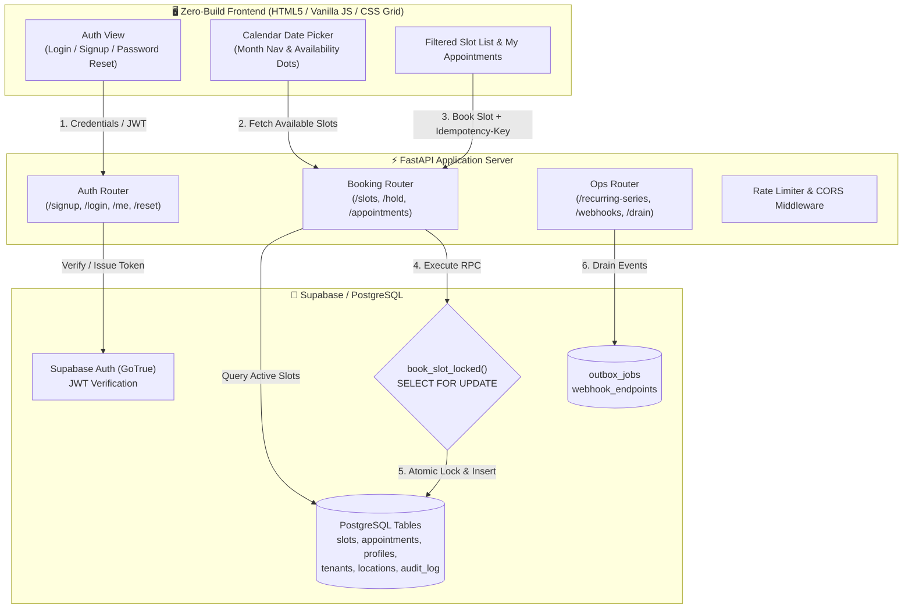
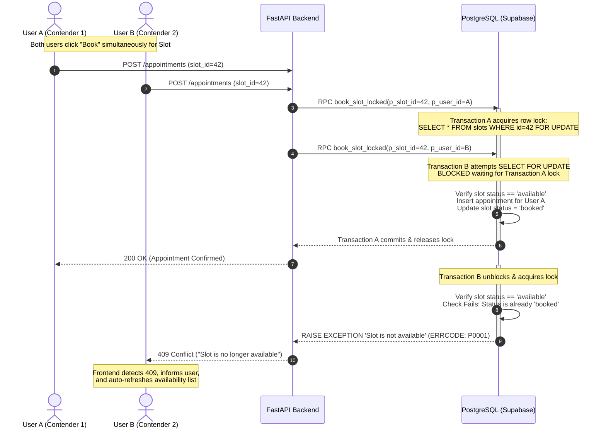
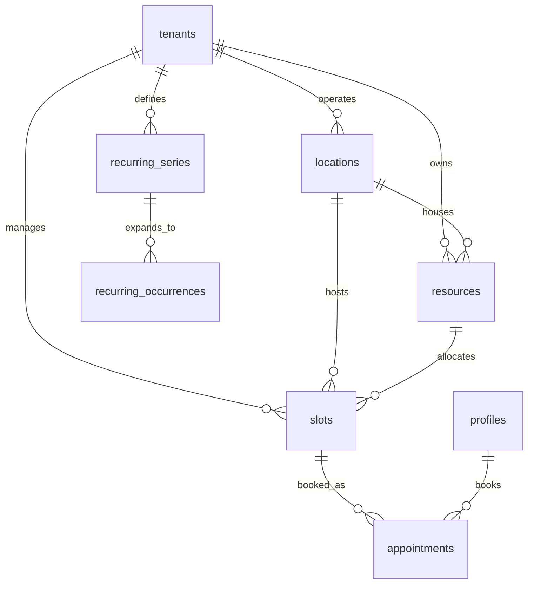

# 📅 Appointment Booking System

<p align="center">
  <a href="https://github.com/divaznx/appointment-booking">
    
  </a>
  <a href="https://fastapi.tiangolo.com/">
    
  </a>
  <a href="https://supabase.com/">
    
  </a>
  <a href="https://docs.pytest.org/">
    
  </a>
  <a href="LICENSE">
    
  </a>
  <a href="https://developer.mozilla.org/en-US/docs/Web/JavaScript">
    
  </a>
</p>

<p align="center">
  <b>A production-ready, concurrency-safe appointment booking platform engineered with FastAPI and Supabase.</b><br/>
  Featuring atomic row-level database locking to eliminate double-bookings, a zero-build reactive calendar UI, and a comprehensive authentication system.
</p>

---

## 📑 Table of Contents

- [Overview](#-overview)
- [Key Features](#-key-features)
- [System Architecture](#-system-architecture)
- [Project Structure](#-project-structure)
- [Concurrency & Locking Deep-Dive](#-concurrency--locking-deep-dive)
- [API Reference](#-api-reference)
- [Database Schema & Migrations](#-database-schema--migrations)
- [Getting Started](#-getting-started)
  - [Prerequisites](#prerequisites)
  - [Installation & Setup](#installation--setup)
  - [Environment Variables](#environment-variables)
  - [Database Migrations](#database-migrations)
  - [Running the Application](#running-the-application)
- [Frontend Details](#-frontend-details)
- [Testing & Quality Assurance](#-testing--quality-assurance)
- [Docker Deployment](#-docker-deployment)
- [Security & Compliance](#-security--compliance)
- [License](#-license)

---

## 🌟 Overview

The **Appointment Booking System** provides a resilient backend and responsive web client for scheduling appointments across organizations, locations, and service resources. 

Unlike traditional scheduling apps that rely on fragile client-side or application-level concurrency checks, this system guarantees **ACID compliance** and absolute immunity to race conditions using PostgreSQL row-level locks (`SELECT FOR UPDATE`) executed directly inside atomic stored procedures.

### Core Capabilities

- **Zero Race Conditions**: True row-level locking ensures that simultaneous booking requests for the same slot result in exactly one winner and an immediate, friendly `409 Conflict` resolution for contenders.
- **Modern Interactive UI**: Minimalist, high-performance calendar and authentication client built entirely in vanilla JavaScript and CSS Grid with zero npm dependencies.
- **Enterprise-Ready Auth**: Complete authentication lifecycle featuring email/password credentials, real-time validation, password recovery workflows, OAuth redirects, and GDPR-compliant account export/deletion.
- **Operational Scalability**: Outbox pattern worker queue for webhook delivery, materialized RFC 5545 recurring schedules, and multi-tenant resource filtering.

---

## ✨ Key Features

### 🔐 Full Authentication & User Identity
- **Tabbed Auth Interface**: Toggle effortlessly between **Sign in** and **Create account** without page reloads.
- **Client-Side & Server-Side Validation**: Immediate inline error feedback for valid email format and minimum 8-character password security.
- **Password Recovery Pipeline**: Dedicated **Forgot Password** and **Reset Password** forms leveraging Supabase Auth recovery tokens.
- **Role-Based Access Control (RBAC)**: Multi-role hierarchy supporting `customer`, `staff`, and `admin` permissions with route-level FastAPI dependencies.
- **Privacy & GDPR Compliance**: Native endpoints for full profile & appointment export (`GET /me/export`) and complete account erasure (`DELETE /me`).

### 🗓️ Interactive Calendar GUI Date Picker
- **Smooth Navigation**: Intuitive chevron navigation across months with instant view recalculation.
- **Visual Status Badges**:
  - **Today's Date**: Highlighted with a distinct accent ring.
  - **Active Selection**: Elevated pill indicator for the currently selected date.
  - **Availability Dots (`•`)**: Subtle visual badges marking dates containing open, bookable slots.
- **Dynamic Slot Filtering**: Automatically isolates and renders only slots corresponding to the selected date.
- **Smart Past-Date Disablement**: Past dates are visibly greyed out and non-interactable.
- **Real-Time Race Feedback**: On 409 conflict, notifies user gracefully and refreshes availability state instantly.

### 🔒 Concurrency & Slot Management
- **Row-Level Pessimistic Locking**: Prevents double-booking via PostgreSQL stored procedure `book_slot_locked`.
- **Flexible Holding Mechanism**: Enables temporary slot reservation (`/slots/{id}/hold`) with configurable expiration timeouts (default: 120s).
- **Idempotency Protection**: Supports standard `Idempotency-Key` headers on booking requests to prevent duplicate bookings caused by network retries.
- **Timezone Intelligence**: Dynamic UTC-to-local timezone conversion using standard IANA timezone keys for client presentation.

### ⚙️ Outbox Pattern & Background Operations
- **Recurring Series (RRULE)**: Materialize future recurring appointment slots using standard RFC 5545 recurrence rules.
- **Reliable Webhooks**: HMAC SHA-256 signature verification and asynchronous transactional outbox drain worker (`/internal/jobs/drain`).

---

## 🏗️ System Architecture



---

## 📂 Project Structure

```text
appointment-booking/
├── .github/
│   └── workflows/
│       └── backend-tests.yml        # CI pipeline running unit & integration tests on Python 3.13
├── backend/
│   ├── app/
│   │   ├── middleware/
│   │   │   ├── __init__.py
│   │   │   └── rate_limit.py        # In-memory IP rate limiter middleware
│   │   ├── routers/
│   │   │   ├── __init__.py
│   │   │   ├── auth.py              # User authentication, signup, login, password reset & GDPR
│   │   │   ├── booking.py           # Slots listing, temporary holds, booking, and cancellations
│   │   │   ├── health.py            # Uptime & readiness probes (/health)
│   │   │   └── ops.py               # Recurring series generation, webhook delivery & outbox drain
│   │   ├── schemas/
│   │   │   ├── appointment.py       # Pydantic schemas for booking, holds, and cancellations
│   │   │   ├── auth.py              # Pydantic schemas for auth requests and password reset
│   │   │   └── ops.py               # Pydantic schemas for series creation and webhook payloads
│   │   ├── security/
│   │   │   ├── __init__.py
│   │   │   └── webhooks.py          # HMAC SHA-256 payload signing and verification
│   │   ├── services/
│   │   │   ├── __init__.py
│   │   │   ├── audit.py             # Audit trail event logger
│   │   │   ├── availability.py      # Slot discovery, timezone offsets & capacity queries
│   │   │   ├── booking.py           # High-level booking orchestration and RPC callers
│   │   │   ├── recurrence.py        # RFC 5545 recurrence rule materialization engine
│   │   │   └── state_machine.py     # Slot lifecycle state validation (available → held → booked)
│   │   ├── config.py                # Pydantic-settings configuration & environment parsing
│   │   ├── dependencies.py          # FastAPI dependencies: JWT bearer extractors & RBAC guards
│   │   ├── errors.py                # PostgreSQL and Supabase error mapping to HTTP 400/404/409
│   │   ├── logging_config.py        # Structured application logging setup
│   │   ├── main.py                  # FastAPI initialization, CORS, static frontend mount
│   │   └── supabase_client.py       # Supabase client singleton instance
│   ├── sql/
│   │   ├── 001_production_booking.sql      # Schema definitions, tables & book_slot_locked function
│   │   ├── 002_cancel_forbidden.sql        # Authorization rules for slot cancellations
│   │   └── 003_book_unique_violation.sql   # Idempotency indices and unique constraint guards
│   ├── tests/
│   │   ├── conftest.py              # Pytest fixtures and mock setup
│   │   ├── test_api_integration.py  # End-to-end API integration tests
│   │   ├── test_availability.py     # Slot availability, timezone calculation tests
│   │   ├── test_errors.py           # Error handling and mapping validation
│   │   ├── test_state_machine.py    # Slot state transition and lifecycle tests
│   │   └── test_webhooks.py         # Signature verification and HMAC test cases
│   ├── .env.example                 # Environment configuration template
│   └── pytest.ini                   # Pytest options and testpaths configuration
├── frontend/
│   ├── app.js                       # Vanilla client logic: auth state, calendar picker, booking API
│   ├── index.html                   # Accessible HTML5 structure: auth modal, calendar, slots grid
│   ├── styles.css                   # Responsive design system: tokens, calendar grid, micro-animations
│   └── README.md                    # Frontend standalone quickstart guide
├── .dockerignore                    # Build exclusions for Docker containerization
├── .gitignore                       # Git exclusions for Python virtualenvs and temporary files
├── Dockerfile                       # Multi-stage production container configuration
├── requirements.txt                 # Pinned backend Python dependencies
└── README.md                        # Master project documentation
```

---

## 🔒 Concurrency & Locking Deep-Dive

In booking platforms, concurrent requests for the exact same slot frequently result in race conditions where two users are mistakenly confirmed for the same resource (double-booking).

This application resolves race conditions at the database transaction layer rather than the application layer:



### Key Locking Guarantees:
1. **Pessimistic Row Lock**: `SELECT ... FOR UPDATE` acquires an exclusive lock on the row in table `slots`. Contenders are queued sequentially.
2. **Atomic Verification**: Slot status is verified inside the active transaction block before an appointment record is written.
3. **Graceful UI Recovery**: Backend translates PostgreSQL error code `P0001` to `409 Conflict`. The client traps this, renders a contextual alert, and triggers an immediate refresh of the slot list.

---

## 📡 API Reference

### Authentication & User Identity

| Method | Endpoint | Access | Description |
|---|---|:---:|---|
| `POST` | `/signup` | Public | Register new user account (`email`, `password`) |
| `POST` | `/login` | Public | Authenticate user; returns Bearer JWT and refresh token |
| `POST` | `/forgot-password` | Public | Request a password reset recovery email via Supabase Auth |
| `POST` | `/reset-password` | Public | Set new password using recovery access token (`new_password`) |
| `GET` | `/oauth/{provider}/url` | Public | Obtain authorization URL for OAuth providers (`google`, `apple`, `azure`, `github`) |
| `GET` | `/me` | Authenticated | Fetch current user's profile, role, and tenant ID |
| `GET` | `/me/export` | Authenticated | GDPR data export containing user record and all appointments |
| `DELETE` | `/me` | Authenticated | GDPR account erasure: deletes appointments, profile, and user |

### Appointment Scheduling

| Method | Endpoint | Access | Description |
|---|---|:---:|---|
| `GET` | `/slots` | Public | List bookable future slots (filters: `tenant_id`, `location_id`, `tz`) |
| `POST` | `/slots/{id}/hold` | Authenticated | Temporarily hold a slot (`hold_seconds`, default: 120s) |
| `POST` | `/appointments` | Authenticated | Book a slot (`slot_id`, optional `Idempotency-Key` header) |
| `GET` | `/appointments` | Authenticated | List all active appointments for the authenticated user |
| `DELETE` | `/appointments/{id}` | Authenticated | Cancel appointment by ID (users cancel own, staff cancels any) |
| `DELETE` | `/appointments` | Authenticated | Cancel appointment via JSON body payload (`appointment_id`) |

### Administration & Operations

| Method | Endpoint | Access | Description |
|---|---|:---:|---|
| `POST` | `/recurring-series` | Staff / Admin | Generate recurring appointment slots via RFC 5545 RRULE |
| `POST` | `/webhooks/endpoints` | Admin | Register external webhook subscriber endpoint |
| `POST` | `/webhooks/inbound` | Public | Process incoming webhook with HMAC signature verification |
| `POST` | `/internal/jobs/drain` | Admin | Trigger transactional outbox processor to deliver webhook jobs |
| `GET` | `/health` | Public | Health probe returning service status and timestamp |

---

## 🗄️ Database Schema & Migrations

The database layer runs on PostgreSQL (Supabase) and consists of three modular migration scripts located in [`backend/sql/`](backend/sql/):



### Table Definitions

- **`tenants`**: Multi-tenant organizations.
- **`locations`**: Physical or virtual branches with designated IANA timezones.
- **`resources`**: Staff, rooms, or equipment with defined booking models (`single` vs `capacity`).
- **`profiles`**: User account extensions storing roles (`customer`, `staff`, `admin`) linked to Supabase Auth `auth.users`.
- **`slots`**: Available scheduling windows with capacity tracking and hold expirations (`held_until`, `held_by`).
- **`appointments`**: Confirmed or held reservations containing user references, idempotency keys, and cancellation timestamps.
- **`audit_log`**: Comprehensive audit history tracking user signups, logins, bookings, holds, and GDPR deletions.
- **`outbox_jobs`**: Transactional outbox event store for asynchronous webhook notification dispatch.
- **`recurring_series` & `recurring_occurrences`**: Materialized series occurrences computed from iCalendar `RRULE` expressions.

---

## 🚀 Getting Started

### Prerequisites

- **Python 3.11+** (tested on Python 3.13)
- **Supabase Project** (cloud hosted or local Supabase CLI instance)
- **Git**

### Installation & Setup

1. **Clone the repository**:
   ```bash
   git clone https://github.com/divaznx/appointment-booking.git
   cd appointment-booking
   ```

2. **Create and activate a virtual environment**:
   ```bash
   # Windows (PowerShell)
   python -m venv venv
   .\venv\Scripts\Activate.ps1

   # macOS / Linux
   python3 -m venv venv
   source venv/bin/activate
   ```

3. **Install dependencies**:
   ```bash
   pip install -r requirements.txt
   ```

### Environment Variables

Create your local environment file in `backend/.env`:

```bash
cp backend/.env.example backend/.env
```

Configure `backend/.env` with your project parameters:

```ini
# Supabase Configuration
SUPABASE_URL=https://your-project.supabase.co
SUPABASE_KEY=your-supabase-service-role-key

# Application Settings
ENVIRONMENT=development
LOG_LEVEL=INFO
AUTO_CONFIRM_EMAIL=true

# CORS Configuration (comma-separated origins)
CORS_ORIGINS=http://localhost:3000,http://127.0.0.1:3000,http://localhost:8000,http://127.0.0.1:8000

# Security & Operations
WEBHOOK_SECRET=your-webhook-hmac-secret-key
INTERNAL_JOB_TOKEN=your-internal-worker-secret-token
```

> [!IMPORTANT]
> The backend requires the Supabase **service role key** (`SUPABASE_KEY`) to execute admin procedures such as bypassing RLS for locked booking functions, updating user confirmation statuses, and dispatching outbox jobs.

### Database Migrations

Apply the migration scripts in sequential order inside the **Supabase SQL Editor**:

1. [`backend/sql/001_production_booking.sql`](backend/sql/001_production_booking.sql): Sets up tables, indices, and the `book_slot_locked` & `hold_slot` stored procedures.
2. [`backend/sql/002_cancel_forbidden.sql`](backend/sql/002_cancel_forbidden.sql): Establishes row-level permissions for appointment cancellation.
3. [`backend/sql/003_book_unique_violation.sql`](backend/sql/003_book_unique_violation.sql): Adds unique constraints and idempotency validation.

### Running the Application

#### Option A: Unified Deployment (Recommended)
FastAPI automatically serves the static frontend directly from the root route `/`:

```bash
cd backend
uvicorn app.main:app --reload --port 8000
```
- **Web UI & Calendar**: Open [http://127.0.0.1:8000](http://127.0.0.1:8000)
- **Interactive Swagger Docs**: Open [http://127.0.0.1:8000/docs](http://127.0.0.1:8000/docs)
- **Health Endpoint**: [http://127.0.0.1:8000/health](http://127.0.0.1:8000/health)

#### Option B: Standalone Frontend Server
If you prefer developing the frontend with a separate HTTP server:

```bash
# Terminal 1: Backend API
cd backend
uvicorn app.main:app --reload --port 8000

# Terminal 2: Static Frontend
cd frontend
python -m http.server 3000
```
- Open [http://127.0.0.1:3000](http://127.0.0.1:3000)

---

## 💻 Frontend Details

The frontend client located in [`frontend/`](frontend/) is intentionally engineered with **zero build steps** and **no npm dependencies**:

- **Modern Responsive Design**: Built on modern CSS custom properties (design tokens), flexible box layout, and CSS Grid.
- **Interactive Calendar Widget**:
  - Automatically calculates month matrices, leap years, and weekday alignment.
  - Dynamically attaches availability markers based on incoming slot start times.
  - Responsive calendar sizing adapts seamlessly to mobile portrait viewports.
- **Client State Management**:
  - Persists JWT tokens, refresh tokens, and session information in `localStorage`.
  - Supports automatic session restoration on browser refresh.
  - Intercepts expiration and automatically handles session teardown.

---

## 🧪 Testing & Quality Assurance

The backend includes a comprehensive automated test suite powered by `pytest` and `pytest-asyncio`.

### Running All Tests

```bash
cd backend
pytest tests/ -v
```

### Test Suite Structure

| Test File | Description |
|---|---|
| [`test_api_integration.py`](backend/tests/test_api_integration.py) | Full booking lifecycle, concurrent race condition simulations, and IDOR cancellation guards |
| [`test_availability.py`](backend/tests/test_availability.py) | Slot time parsing, UTC conversions, and multi-capacity threshold validation |
| [`test_state_machine.py`](backend/tests/test_state_machine.py) | Validates state transitions (`available` → `held` → `booked` → `cancelled`) |
| [`test_errors.py`](backend/tests/test_errors.py) | Validates PostgreSQL error code mapping to HTTP 400, 404, and 409 responses |
| [`test_webhooks.py`](backend/tests/test_webhooks.py) | Validates HMAC SHA-256 payload canonicalization, signature generation, and verification |

### Continuous Integration (CI)

Every push or pull request touching `backend/**` triggers the GitHub Actions workflow [`.github/workflows/backend-tests.yml`](.github/workflows/backend-tests.yml), verifying that unit and integration tests cleanly pass on Python 3.13.

---

## 🐳 Docker Deployment

The application includes a production-ready `Dockerfile` for streamlined containerized deployment (e.g., on Render, AWS ECS, GCP Cloud Run, or Docker Compose).

### Build & Run Container

```bash
# Build the Docker image
docker build -t appointment-booking-backend .

# Run the container with environment file
docker run -d -p 8000:8000 --env-file backend/.env --name appointment-booking appointment-booking-backend
```

The container exposes port `8000` with both API endpoints and the unified static frontend served automatically.

---

## 🛡️ Security & Compliance

- **Pessimistic Row-Level Locking**: Guarantees zero double bookings directly in PostgreSQL.
- **Idempotency Safeguards**: Protects API clients from accidental duplicate bookings during network dropouts via `Idempotency-Key` headers.
- **HMAC Signatures**: External webhooks are signed and verified using `X-Signature` HMAC SHA-256 hashes.
- **GDPR Ready**:
  - `GET /me/export`: Full portability export of user data and historical appointments.
  - `DELETE /me`: Right to erasure (Right to be Forgotten) removing all user records and associations.
- **Rate Limiting**: Built-in middleware protecting API routes against high-volume brute-force attacks.

---

## 📄 License

Distributed under the MIT License. See [`LICENSE`](LICENSE) for complete details.
